# 2023년 벤처스타트업SW아카데미 해커톤 🥉
**주관** : 코리아스타트업포럼  
**주제** : **게임 플랫폼 스타트업인 B사가 사용자의 취향에 맞는 게임을 추천할 수 있는 아이디어 구현**, 이커머스 스타트업인 A사에서 블랙프라이데이 이벤트 시 폭발적인 사용자 주문을 처리할 수 있는 아이디어 구현 (택1)  
**기간** : 2023.08.29 ~ 2023.08.30 (무박 2일 진행)  
**팀 소개** : 낭만젊음사랑  
- [김윤정](https://github.com/kingodjerry) : 팀장, AI
- 전필규 : PM
- 조아라 : Design
- 최인영 : FE

2023년 1학기 종강 후 여름방학, 벤처스타트업 SW아카데미 수강생들에게 해커톤에 나갈 수 있는 기회가 주어졌고, (해커톤이라는 낭만에 기대찬) 경영학전공 4인 1팀으로 팀을 꾸려 해커톤에 참가하게 되었다. 당시에는 막 파이썬과 AI 기초를 배운 상태라 간단한 AI 모델 구현, 데이터 시각화 정도만 할 수 있었다... 팀 내에도 개발을 배운 사람이 없어 프로토타입 구현을 위해 벼락치기로 프론트엔드를 공부했다 😭   

## 문제정의 및 아이디어 도출

이전에 '잠재요인 기반 협업필터링 추천 알고리즘'을 공부했던 경험을 살려, '게임 추천 알고리즘 구현' 주제를 선택했다. 아이디어 도출 과정에서 멘토님께 "**기술이 너무 진부하다**"라는 조언을 받았고, 우리는 처음으로 돌아가서 '모두가 같은 알고리즘을 사용한다면 **INPUT DATA**에 변화를 주자'는 아이디어를 냈다.   
  

**"친구한테 게임 추천할 때 어떻게 추천해?"**   
 

우리는 누군가에게 무엇을 추천할 때 **그 사람의 호감도**를 생각하여 추천한다. 즉, **축구**를 좋아하는 친구A는 축구선수, 축구유니폼, 축구 경기 관람 등 **축구 관련 취미에 대한 호감도가 높다**는 점을 이용하는 것이다. 결정적으로, 친구A는 **축구게임인 'FIFA'를 선호할 가능성**이 매우 높다. 
  

그래서 우리는 Input data로 **취미 관련 데이터**를 사용하기로 결정했다.  

## 구현

캐글에서 movie, game dataset을 찾아 사용하였으며, 정확한 출처는 남아있지 않다. <del>(기록해둔 notion이 대회 종료와 함께 날아가버렸기에... 해커톤 무경험자라 너무 긴장해서 따로 작성해둘 생각을 못했다.)</del> 데이터셋은 각각 [영화명, 사용자 아이디, 날짜, 리뷰] / [게임명, 사용자 아이디, 날짜, 리뷰] 구성되어 있다.   
 

**1. 데이터 전처리**
   - csv 파일 읽어오기
   - 게임 리뷰 데이터에서 1차 불용어 처리 ("game", "play", "really" 등등)
   - 게임 데이터 워드클라우드 시각화
   - 시각화 후, 크게 나타나는 불필요한 용어 2차 불용어 처리 ("sometime", "better", "say" 등등)
   - TF-IDF(Term Frequency - Inverse Document Frequency)

해당 과정에서는 불용어 처리 후 **TF-IDF 벡터화**를 사용하여 해당 단어가 실질적으로 중요한 단어인지를 구분하도록 만들었다. 단순한 카운트 기반 벡터화는 단어가 언급된 빈도수로 중요도(높은 가중치)를 부여하지만, TF-IDF는 모든 데이터에서 자주 나타나는 단어에는 패널티를 적용하여 해당 게임에서만 자주 등장하는 핵심 단어에 높은 가중치를 부여한다.   
 

**2. 기존의 게임 추천 알고리즘 구현**
   - 사용자가 즐겨하던 게임 데이터 입력받기
   - 입력받은 데이터와 게임 데이터의 키워드 유사도(코사인 유사도)를 계산하여 유사한 게임 1개, 상반된 게임 1개 추천
 

**3. 취미 데이터 기반 게임 추천 알고리즘 구현**
   - 사용자가 즐겨보던 영화 데이터 입력받기
   - 입력받은 데이터와 게임 데이터의 키워드 유사도(코사인 유사도)를 계산하여 유사한 게임 1개, 상반된 게임 1개 추천
 

알고리즘 구현에서 상반된 게임을 추천한 이유는 "FPS라고 다 같은 FPS 게임이 아니다"라는 의견 때문이었다.  
게임을 좋아하는 사람들은 이해할 수 있다. 예를 들어, 오버워치, 배틀그라운드, 발로란트, 서든어택은 **모두 같은 FPS 게임이지만, 사용하는 감도와 플레이 방식, 그래픽이 매우 다르다**. 이러한 점 때문에 **사용자는 본인이 즐겨하는 게임만을 고집하는 경향이 있다.**   
우리는 이러한 특이점을 고려하여 **상반된 게임 2개, 유사한 게임 2개**를 Output으로 도출했다.  

## 최종발표자료 및 결과
코리아스타트업포럼 의장상(우수상)을 수상하였으며, 해커톤 당시 발표자료를 참고하여 이후에 제작된 ppt를 첨부한다. 

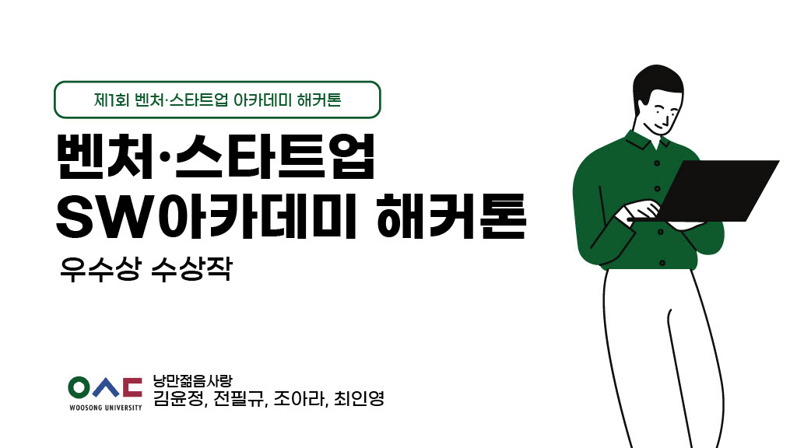
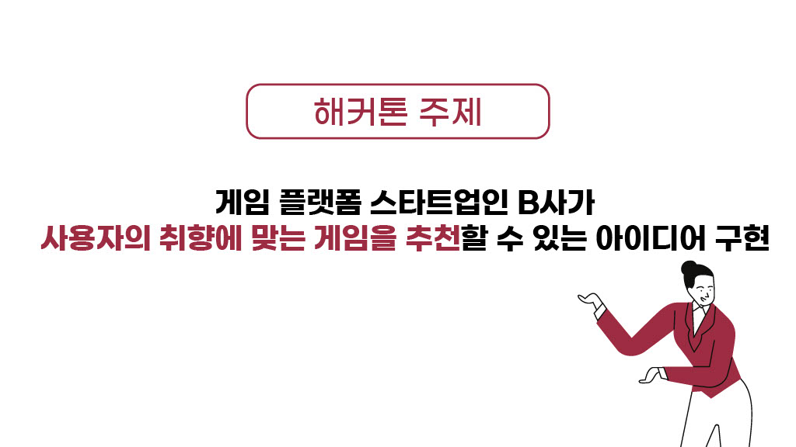
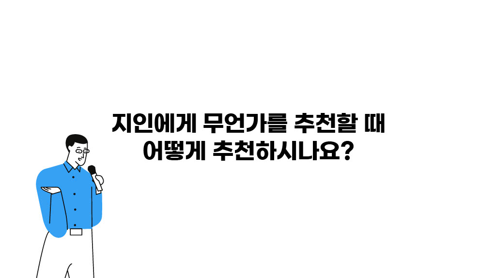
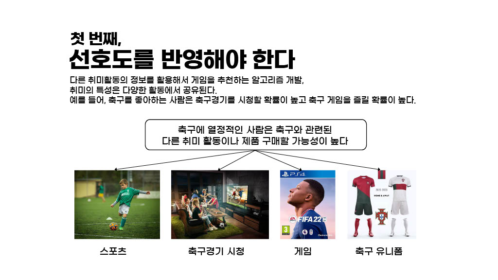
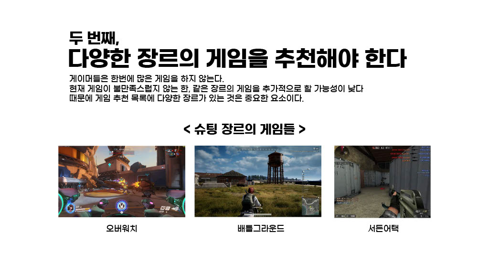
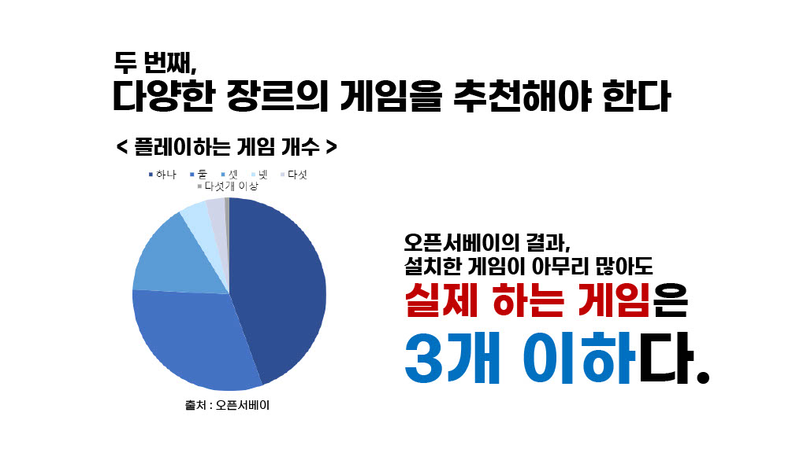
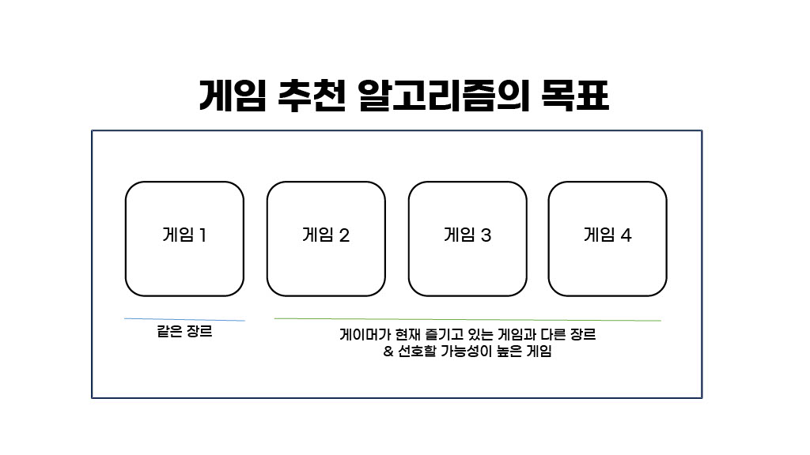
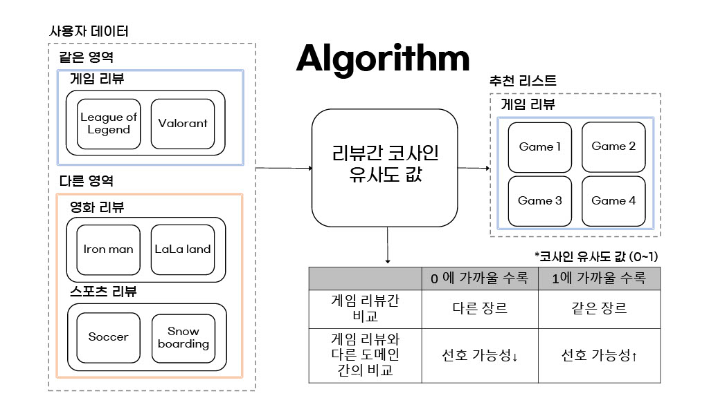
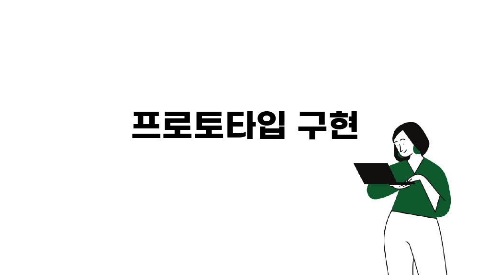
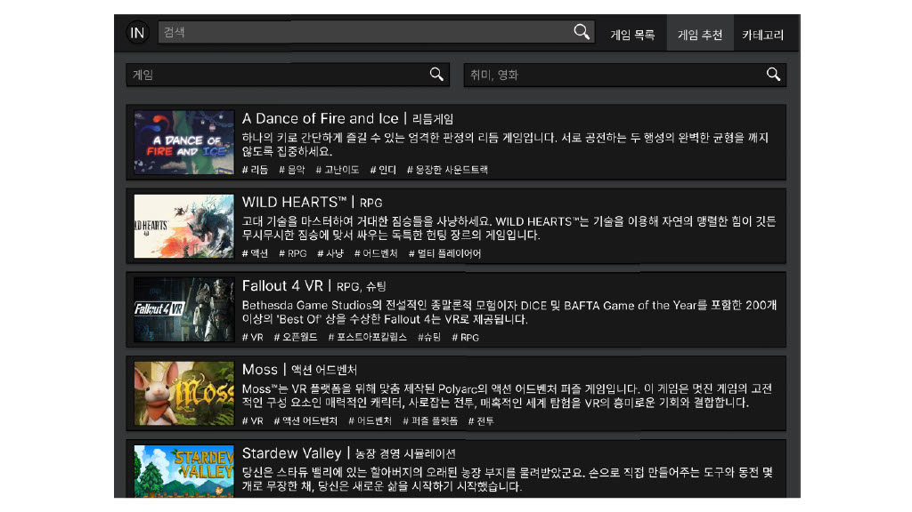
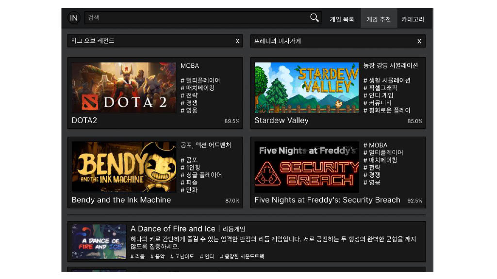
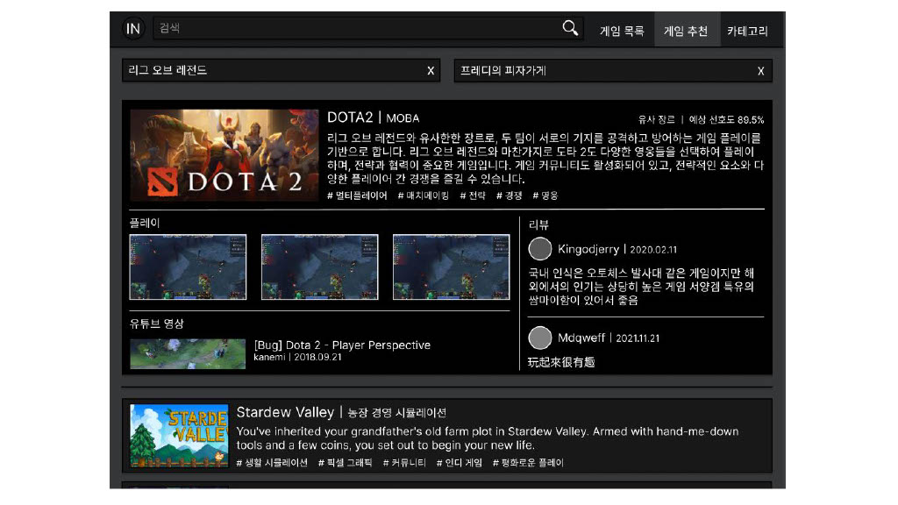
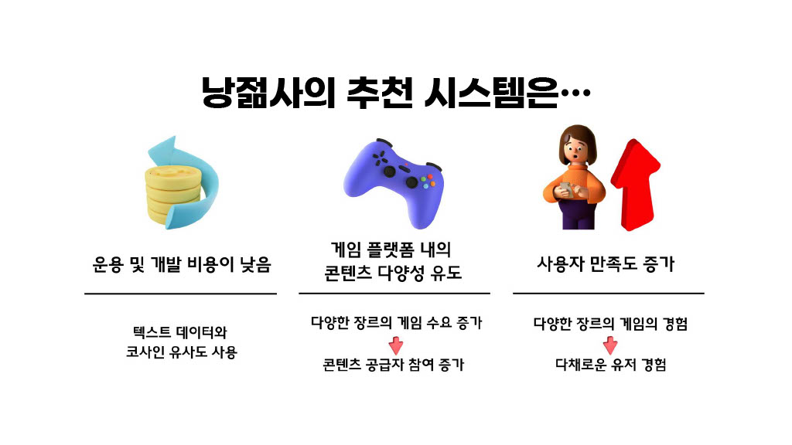
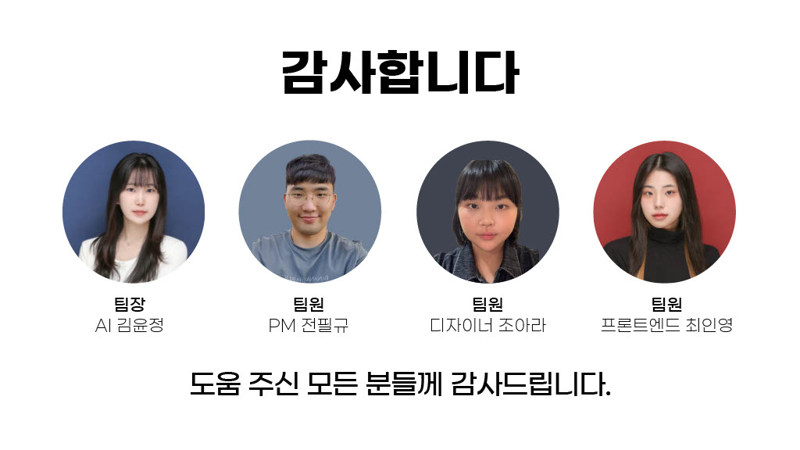
